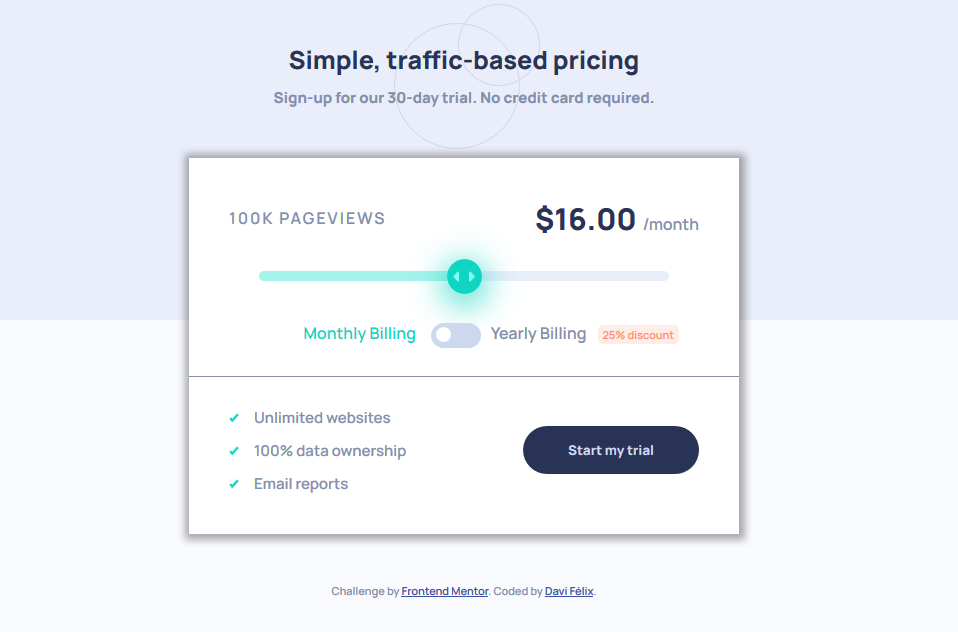

# Frontend Mentor - Interactive pricing component

## Welcome! 👋

Resolução de desafio do site [Frontend Mentor](https://www.frontendmentor.io) com o objeto de melhorar
minhas habilidades com HTML, CSS e Java Script

**Esse desafio exige conhecimento básicos de HTML, CSS e Java Script**

## The challenge

O desafio é contruir um componente de preço interativo, fanzendo-o parecer o máximo possível com o design
proposto usando as ferramentas que forem julgadas necessárias

## Os usuário devem poder

- Ver o design otimizado para o tamanho de suas telas
- Perceber claramente os elementos com so quais pode interagir
- Usar o slider para ver os diferentes preços para cada número de vizualizações